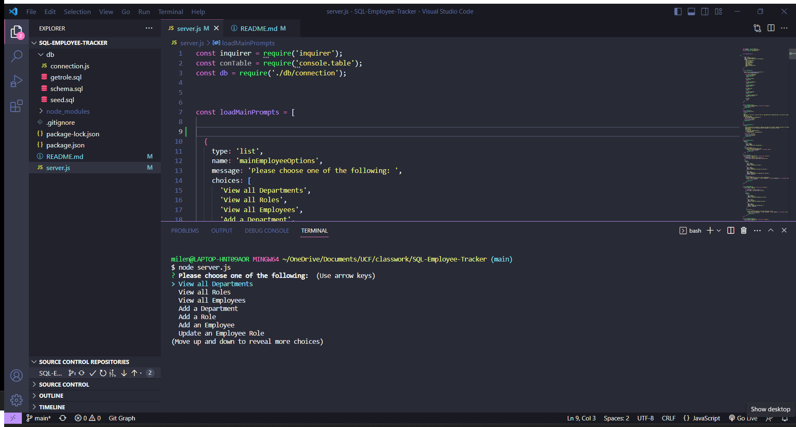
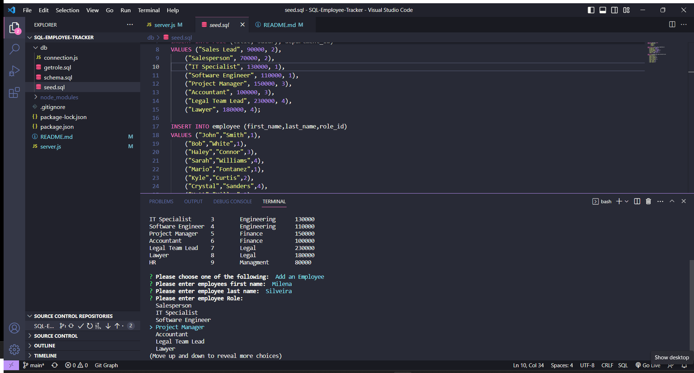

# SQL-Employee-Tracker

## Description

This project was developed with Node.js and is intended to facilitate employee management databases.
The application allows the user to view all departments, roles, and employees logged in. The options of adding a new role, adding a new employee, and updating an employee are also available.

## Installation

You can clone this application from GitHub and add it to your command line.

## Usage

Initiate a command prompt, type server.js, and hit enter. The options mentioned in the description will display
on the command line. Simply navigate through them, and as you make your selection, it will operate the database accordingly.

## Screenshots

## Video Link

